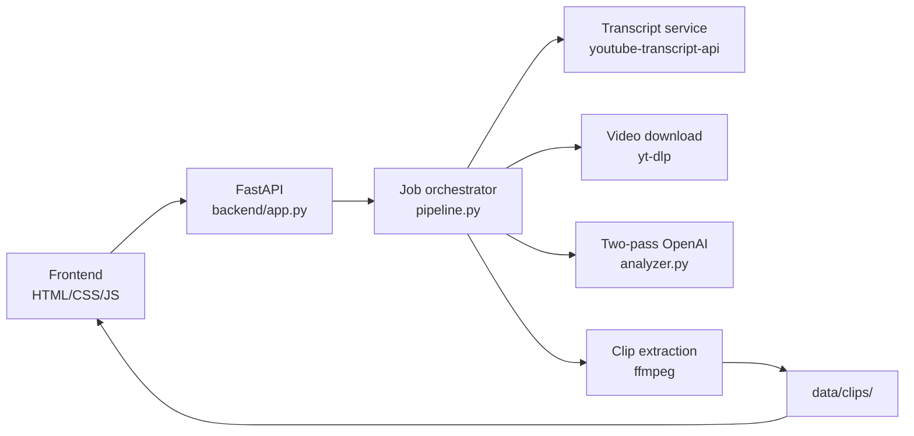

<callout icon="🎬" color="green_bg">
**Motivation Video Assembler** — paste a motivational YouTube URL, find the best moments with a two-pass OpenAI analysis, cut preview clips with ffmpeg, and browse them in a clean product UI.
</callout>

<callout icon="📌" color="blue_bg">
**Status — July 5, 2026:** Phase 1 + clip database shipped. Transcript-synced **Studio** for manual clipping, indexed **Database** with tags/search/local save, AI auto-clip still available. Next: montage export + E2E QA.
</callout>

<table_of_contents/>

---

## Quick links

<columns>
	<column>
		<callout icon="🐙" color="gray_bg">
			**GitHub**
			motivation-video-assembler
			Python · FastAPI · OpenAI · ffmpeg
		</callout>
	</column>
	<column>
		<callout icon="📐" color="gray_bg">
			**Linear**
			Project: Motivation Video Assembler
			All tickets assigned to James Yang
		</callout>
	</column>
</columns>

---

## Overview

Motivation Video Assembler is a local-first pipeline for turning long motivational speeches on YouTube into a **library of short, high-impact clips** grouped by semantic category.

**Primary user flow**
1. Paste a YouTube URL on **Analyze** (optional AI auto-clip)
2. Pipeline downloads video + extracts timestamped transcript (captions or Whisper)
3. **Studio** — manually clip from transcript timeline with labels/tags
4. **Database** — search, filter, preview, download MP4s saved locally

**Why this exists**
- Manual scrubbing through 20–60 minute speeches is slow
- Social clips need **self-contained moments** with clean in/out points
- A two-pass LLM workflow reduces timestamp drift and bad quotes

---

## Goals

### Phase 1 — MVP (shipped)
- Pull timestamped YouTube captions (+ Whisper fallback)
- Two-pass OpenAI analysis for 6 moment categories
- Download source video + ffmpeg clip extraction
- FastAPI backend with job polling
- Product UI: Analyze + Studio + Database

### Phase 1.5 — Clip database (shipped)
- Indexed clip store (`data/database/index.json`)
- Manual clipping in Studio synced to transcript timestamps
- Tags, categories, search, metadata editing
- Local save to `data/database/clips/` + browser download
- AI auto-clip + manual clip coexist in one index

### Phase 3 — Assembly
- Select clips from library → stitch into one export MP4
- Optional title card / simple transitions
- Batch job queue + history UI

---

## Architecture



---

## Pipeline stages

<table header-row="true" fit-page-width="true">
	<tr>
		<td>Stage</td>
		<td>Service</td>
		<td>Output</td>
	</tr>
	<tr>
		<td>1. Parse URL</td>
		<td>transcript.py</td>
		<td>YouTube video ID</td>
	</tr>
	<tr>
		<td>2. Fetch transcript</td>
		<td>youtube-transcript-api</td>
		<td>Timestamped segments</td>
	</tr>
	<tr>
		<td>3. Download video</td>
		<td>yt-dlp</td>
		<td>data/videos/{job_id}/source.mp4</td>
	</tr>
	<tr>
		<td>4. Analyze (pass 1)</td>
		<td>OpenAI</td>
		<td>Draft moments by category</td>
	</tr>
	<tr>
		<td>5. Verify (pass 2)</td>
		<td>OpenAI</td>
		<td>Refined moments + review notes</td>
	</tr>
	<tr>
		<td>6. Extract clips</td>
		<td>ffmpeg</td>
		<td>data/clips/{job_id}/*.mp4</td>
	</tr>
	<tr>
		<td>7. Library</td>
		<td>Frontend</td>
		<td>Filter + preview UI</td>
	</tr>
</table>

---

## Moment categories

<table header-row="true" fit-page-width="true">
	<tr>
		<td>Group ID</td>
		<td>Label</td>
		<td>What to look for</td>
	</tr>
	<tr>
		<td>hook</td>
		<td>Hook</td>
		<td>Opening lines that grab attention immediately</td>
	</tr>
	<tr>
		<td>emotional_peak</td>
		<td>Emotional Peak</td>
		<td>Most emotionally charged delivery</td>
	</tr>
	<tr>
		<td>wisdom</td>
		<td>Wisdom</td>
		<td>Clear, memorable insight or lesson</td>
	</tr>
	<tr>
		<td>story_climax</td>
		<td>Story Climax</td>
		<td>Peak of a narrative arc or personal story</td>
	</tr>
	<tr>
		<td>call_to_action</td>
		<td>Call to Action</td>
		<td>Direct challenge or invitation to act</td>
	</tr>
	<tr>
		<td>quotable</td>
		<td>Quotable</td>
		<td>Standalone shareable line</td>
	</tr>
</table>

**Clip rules (enforced in analyzer)**
- Duration: 8–45 seconds (hard cap 60s trimmed)
- Timestamps must match transcript lines
- Quotes must reflect actual speech
- Max 3 moments per group (configurable via `MAX_MOMENTS_PER_GROUP`)

---

## Tech stack

<table header-row="true" fit-page-width="true">
	<tr>
		<td>Layer</td>
		<td>Choice</td>
		<td>Notes</td>
	</tr>
	<tr>
		<td>Backend</td>
		<td>Python 3.11+ · FastAPI · uvicorn</td>
		<td>Serves API + static frontend</td>
	</tr>
	<tr>
		<td>AI</td>
		<td>OpenAI Chat Completions (JSON mode)</td>
		<td>Two-pass: analyze + verify</td>
	</tr>
	<tr>
		<td>Transcript</td>
		<td>youtube-transcript-api</td>
		<td>Requires captions on video</td>
	</tr>
	<tr>
		<td>Video</td>
		<td>yt-dlp + ffmpeg</td>
		<td>Download once, cut many clips</td>
	</tr>
	<tr>
		<td>Frontend</td>
		<td>Vanilla HTML/CSS/JS</td>
		<td>No build step</td>
	</tr>
	<tr>
		<td>Design</td>
		<td>Goated design system</td>
		<td>See DESIGN.md — cream canvas, moss green, serif display</td>
	</tr>
</table>

---

## API reference

<table header-row="true" fit-page-width="true">
	<tr>
		<td>Method</td>
		<td>Path</td>
		<td>Purpose</td>
	</tr>
	<tr>
		<td>GET</td>
		<td>/api/health</td>
		<td>Server + OpenAI config status</td>
	</tr>
	<tr>
		<td>POST</td>
		<td>/api/analyze</td>
		<td>Start job — body: `{ "youtube_url": "..." }`</td>
	</tr>
	<tr>
		<td>GET</td>
		<td>/api/jobs</td>
		<td>List all jobs</td>
	</tr>
	<tr>
		<td>GET</td>
		<td>/api/jobs/{job_id}</td>
		<td>Job status + clips</td>
	</tr>
	<tr>
		<td>GET</td>
		<td>/api/library</td>
		<td>All clips across jobs</td>
	</tr>
	<tr>
		<td>GET</td>
		<td>/api/clips/{job_id}/{filename}</td>
		<td>Stream clip MP4</td>
	</tr>
</table>

---

## Frontend IA

<details>
<summary>Analyze tab</summary>
	- URL input + Analyze button
	- Inline status (info / success / error)
	- Pipeline card (hidden until job starts): stepper + progress %
	- "Open library" CTA on completion
</details>

<details>
<summary>Library tab</summary>
	- Left sidebar: category filter pills + clip list rows
	- Right detail pane: single video player + quote + rationale + source title
	- Empty state with CTA back to Analyze
</details>

**UX principles (UIUX_PROMPT.md)**
- Product tool, not marketing landing page
- One player in library (no grid of embedded videos)
- Segmented nav, tight spacing, scannable metadata
- Moss green = action; stone grey = structure

---

## Data model

**Job** (`data/jobs/{id}.json`)
- id, youtube_url, video_id, status, stage, progress
- video_title, language, analysis, clips[]

**Clip moment**
- id, group, title, quote, start_seconds, end_seconds
- confidence, rationale, clip_filename, clip_url

**On disk**
- `data/videos/{job_id}/source.mp4`
- `data/clips/{job_id}/{moment_id}.mp4`

---

## Environment setup

```bash
cd motivation-video-assembler
python3 -m venv .venv && source .venv/bin/activate
pip install -r backend/requirements.txt
cp .env.example .env
# Add OPENAI_API_KEY
brew install ffmpeg   # if needed
python -m uvicorn backend.app:app --reload --port 8000
```

**.env variables**
<table header-row="true">
	<tr>
		<td>Variable</td>
		<td>Required</td>
		<td>Description</td>
	</tr>
	<tr>
		<td>OPENAI_API_KEY</td>
		<td>Yes</td>
		<td>OpenAI API key</td>
	</tr>
	<tr>
		<td>OPENAI_MODEL</td>
		<td>No</td>
		<td>Analysis model (default gpt-4o)</td>
	</tr>
	<tr>
		<td>OPENAI_VERIFY_MODEL</td>
		<td>No</td>
		<td>Second-pass model</td>
	</tr>
	<tr>
		<td>MAX_MOMENTS_PER_GROUP</td>
		<td>No</td>
		<td>Cap per category (default 3)</td>
	</tr>
</table>

---

## Linear ticket map

<table header-row="true" fit-page-width="true">
	<tr>
		<td>Ticket theme</td>
		<td>Priority</td>
		<td>State</td>
		<td>Owner</td>
	</tr>
	<tr>
		<td>Transcript ingestion</td>
		<td>High</td>
		<td>Done</td>
		<td>James Yang</td>
	</tr>
	<tr>
		<td>Two-pass OpenAI analysis</td>
		<td>High</td>
		<td>Done</td>
		<td>James Yang</td>
	</tr>
	<tr>
		<td>ffmpeg clip extraction</td>
		<td>High</td>
		<td>Done</td>
		<td>James Yang</td>
	</tr>
	<tr>
		<td>FastAPI + job orchestration</td>
		<td>High</td>
		<td>Done</td>
		<td>James Yang</td>
	</tr>
	<tr>
		<td>Analyze UI + pipeline stepper</td>
		<td>High</td>
		<td>Done</td>
		<td>James Yang</td>
	</tr>
	<tr>
		<td>Library master-detail UI</td>
		<td>High</td>
		<td>Done</td>
		<td>James Yang</td>
	</tr>
	<tr>
		<td>Goated UI overhaul</td>
		<td>Medium</td>
		<td>Done</td>
		<td>James Yang</td>
	</tr>
	<tr>
		<td>OpenAI + dev env setup</td>
		<td>High</td>
		<td>Todo</td>
		<td>James Yang</td>
	</tr>
	<tr>
		<td>End-to-end QA (real speeches)</td>
		<td>Urgent</td>
		<td>Todo</td>
		<td>James Yang</td>
	</tr>
	<tr>
		<td>Manual clip boundary editing</td>
		<td>Medium</td>
		<td>Todo</td>
		<td>James Yang</td>
	</tr>
	<tr>
		<td>Montage assembly export</td>
		<td>High</td>
		<td>Todo</td>
		<td>James Yang</td>
	</tr>
	<tr>
		<td>Job history + batch queue</td>
		<td>Low</td>
		<td>Todo</td>
		<td>James Yang</td>
	</tr>
</table>

---

## Acceptance criteria (Phase 2)

- [ ] Analyze completes on 3 real motivational videos without manual fixes
- [ ] Library filters work across all 6 categories
- [ ] Clips play in detail pane with correct in/out points
- [ ] Failed jobs show actionable errors (missing captions, ffmpeg missing, etc.)
- [ ] Notion spec + Linear tickets stay in sync with shipped code

---

## Risks & mitigations

<table header-row="true" fit-page-width="true">
	<tr>
		<td>Risk</td>
		<td>Impact</td>
		<td>Mitigation</td>
	</tr>
	<tr>
		<td>No YouTube captions</td>
		<td>Pipeline fails at transcript</td>
		<td>Clear error + future Whisper fallback</td>
	</tr>
	<tr>
		<td>LLM timestamp drift</td>
		<td>Bad clips</td>
		<td>Two-pass verify + boundary normalization</td>
	</tr>
	<tr>
		<td>yt-dlp blocked</td>
		<td>No source video</td>
		<td>Retry + cookie config docs</td>
	</tr>
	<tr>
		<td>Long videos / cost</td>
		<td>Slow + expensive</td>
		<td>Transcript chunking (future)</td>
	</tr>
</table>

---

## Repo layout

```
backend/
  app.py
  config.py
  services/
    transcript.py
    analyzer.py
    clipper.py
    pipeline.py
frontend/
  index.html
  styles.css
  app.js
data/          # runtime — jobs, clips, videos
DESIGN.md
UIUX_PROMPT.md
```
